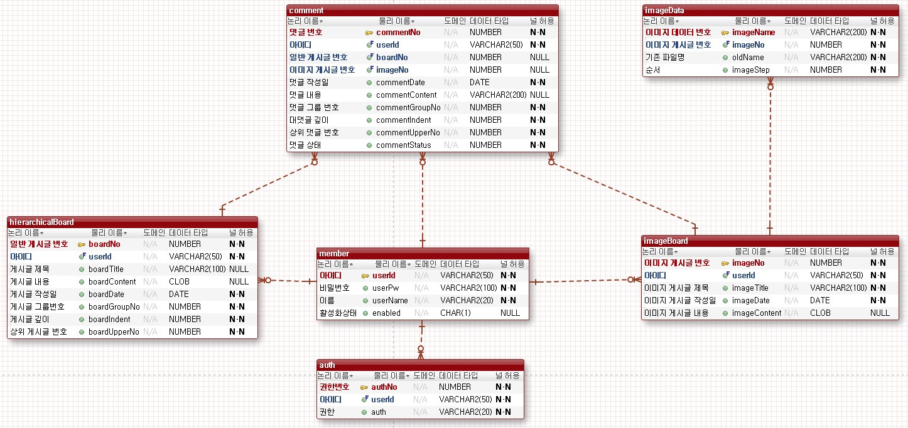
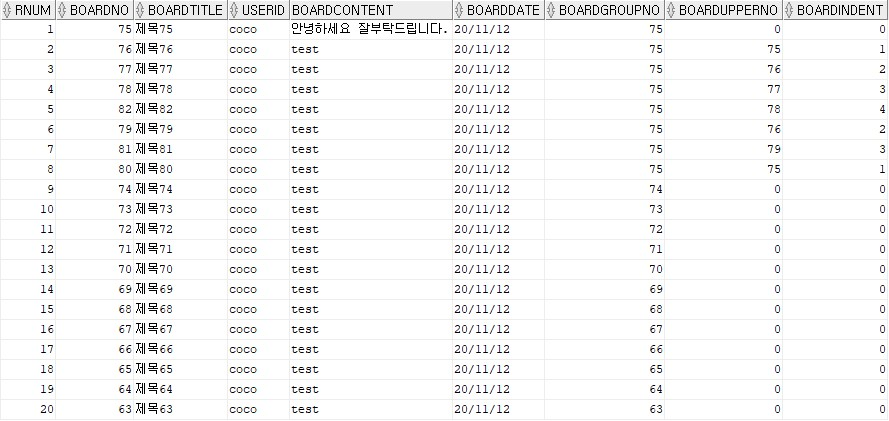
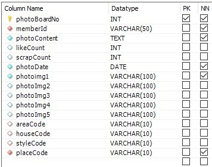
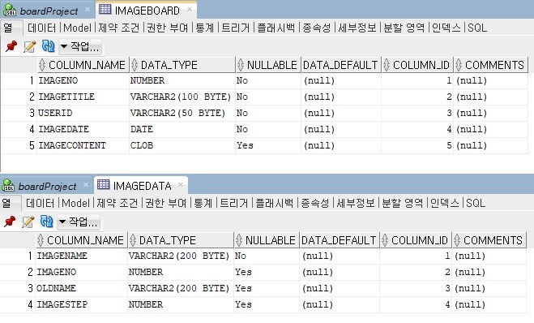
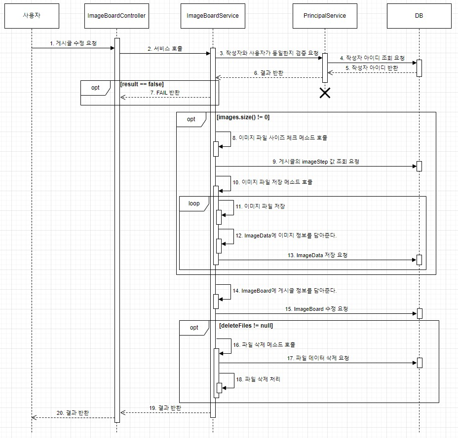

# BoardProject_default


## 목적
* 이미지 업로드 후 수정 기능 구현. 이미지 등록 및 수정 시 개별 삭제 기능 구현.
* oracle사용. Oracle을 이용한 계층형 게시판 구현. 계층형 쿼리 사용.
* 검색 및 페이징 구현.

## 개발환경
* Spring 4.3.3
* Java 8
* Spring Security 5
* MyBatis
* Oracle 11g
* JSP
* Tomcat
* jQuery
* Ajax
* BootStrap
* IDE - Eclipse

## 프로젝트 설명
* 교육과정 중 진행한 최종 프로젝트에서 구현하지 못했던 이미지 게시판 수정처리 기능을 마무리 해보고자 시작한 게시판 형태의 미니 프로젝트
* 텍스트 기반의 게시판과 이미지 업로드가 가능한 게시판으로 구성
* Oracle을 통한 계층형 쿼리 구현
* 로그인과 인증 / 인가는 Spring Security로 처리.

## 프로젝트 기능
* 계층형 게시판
    * 텍스트만 작성이 가능한 게시판
    * 게시글 검색, 페이징, 작성, 수정, 삭제, 답글, 댓글 기능
    * 게시글 삭제 시 하위에 위치하는 게시글 삭제
* 이미지 게시판
    * 텍스트와 함께 이미지를 업로드할 수 있는 게시판
    * 이미지는 최대 5장까지 허용
    * 게시글 검색, 페이징, 작성, 수정, 삭제, 댓글 기능

## ERD


<br/>

## 기능

### 목차
* 계층형 게시판 (쿼리 작성)
* 계층형 게시판 (계층형 구조 삭제 처리)
* 이미지 게시판 (이전 프로젝트 문제 해결)

<br />

## 계층형 게시판 (쿼리 작성)
<br />

  
  계층형 구조는 GroupNo, UpperNo, Indent 컬럼으로 정렬하도록 했습니다.   
  GroupNo는 최상위 글의 글 번호를 기준으로 하위 글과의 그룹을 형성할 수 있도록 했습니다.   
  UpperNo는 바로 한단계 위의 글 번호를 갖도록 처리했으며 최상위글의 경우 참조할 상위 글이 없으므로 0을 갖게 됩니다.   
  Indent는 원글 기준 0을 시작으로 계층이 내려갈수록 증가하게 됩니다.

  ```xml
  <select id="searchPage" resultType="HierarchicalBoardListDTO">
      SELECT  *
      FROM (
          SELECT  ROWNUM AS RNUM, A.*
          FROM    (
              SELECT boardNo
                   , boardTitle
                   , userId
                   , boardDate
                   , boardIndent
              FROM hierarchicalBoard
              WHERE boardNo > 0
              <include refid="search"></include>

              START WITH boardUpperNo = 0
              CONNECT BY PRIOR boardNo = boardUpperNo
              ORDER SIBLINGS BY boardGroupNo DESC
          ) A
      )
      WHERE RNUM
      BETWEEN (#{pageNum} - 1) * #{boardAmount} + 1 AND #{pageNum} * #{boardAmount}
  </select>

  <sql id="search">
      <if test="searchType != null">
          <if test="searchType == 't'.toString()"> AND boardTitle LIKE '%' || #{keyword} || '%'</if>
          <if test="searchType == 'c'.toString()"> AND boardContent LIKE '%' || #{keyword} || '%'</if>
          <if test="searchType == 'w'.toString()"> AND userId LIKE '%' || #{keyword} || '%'</if>
          <if test="searchType == 'tc'.toString()"> AND (boardTitle LIKE '%' || #{keyword} || '%') or (boardContent LIKE '%' || #{keyword} || '%')</if>
      </if>
  </sql>
  ```

  쿼리에서는 START WITH 구문을 통해 UpperNo가 0인 것을 시작으로 boardNo가 BoardUpperNo에 존재하는 데이터를 하단에 배치하도록 처리했습니다.   
  기본 조회와 검색 기능에 대한 동적 처리를 위해 동적 쿼리로 작성했습니다.

<br/>
<br/>

## 계층형 게시판 (계층형 구조 삭제 처리)

<br />

  계층형 구조에서의 게시글 삭제 요청이 발생하는 경우 하위 글 역시 삭제됩니다.   
  각 게시글 데이터는 UpperNo에 자신의 한단계 상위의 데이터만 담고 있기 때문에 단계적으로 내려가며 데이터를 찾아야 했습니다.   
  이 문제를 해결하기 위해 재귀함수를 사용했습니다.

  ```java
  @Override
  @Transactional(rollbackFor = {Exception.class})
  public int boardDelete(int boardNo, Principal principal) {
    if(!principalService.checkWriter(boardNo, "board", principal))
        return ResultProperteis.FAIL;
  
    HierarchicalBoardDeleteDTO hierarchicalBoardDeleteDTO = boardMapper.checkDeleteNo(boardNo);
  
    //upperNo == 0 인 경우 최상위 글이기 때문에 GroupNo 기준으로 삭제 요청
    //답글이 없는 경우더라도 GroupNo는 자기 자신의 글 번호를 갖고 있으니 상관없다.
    if(hierarchicalBoardDeleteDTO.getBoardUpperNo() == 0)
        boardMapper.deleteBoardGroup(hierarhicalBoardGroupDeleteDTO.getBoardGroupNo());
    else{
        //같은 groupNo를 갖고 있는 게시글 list
        List<HierarchicalBoardDeleteDTO> dto = boardMapper.groupData(hierarchicalBoardDeleteDTO.getBoardGroupNo());
        //삭제할 boardNo 리스트
        List<Integer> deleteNoList = new ArrayList<>();
        //삭제 요청이 들어온 boardNo를 먼저 담아줌.
        deleteNoList.add(boardNo);
        //삭제 요청이 들어온 게시글의 하위 글들을 찾아 list에 담아준다.
        deleteData(dto, boardNo, 0, deleteNoList);
  
        boardMapper.deleteHierarchicalList(deleteNoList);
    }
    return ResultProperties.SUCCESS;
  }
  
  /**
  * 재귀 호출을 통해 요청이 들어온 게시글의 하위 글들을 찾아 리스트에 담아준다.
  * 계층형 게시판 특성상 하위글이 상위글보다 글번호가 클 수 없기 때문에 리스트의 특정위치 이후로만 검색하며 찾도록 한다.
  * 이 조건을 만족하기 위해 데이터를 조회할 때 boardNo 기준 오름차순으로 가져오도록 쿼리를 작성.
  */
  public void deleteData(List<HierarchicalBoardDeleteDTO> dto, int delNo, int idx, List<Integer> deleteNoList) {
    for(int i = idx; i < dto.size(); i++) {
        if(dto.get(i).getBoardUpperNo() == delNo) {
            int no = dto.get(i).getBoardNo();
            deleteNoList.add(no);
            deleteData(dto, no, i, deleteNoList);
        } 
    }
  }
  ```
  <br/>
  재귀 함수 처리로는 삭제 요청이 들어온 게시글의 글번호를 UpperNo에 담고 있는 데이터를 찾고, 찾은 데이터를 리스트에 담아준 뒤 재귀 호출로 해당 데이터의 하위 게시글을 다시 검색하는 형태로 처리합니다.
<br/>

### 이미지 게시판 (이전 프로젝트 문제 해결)

<br />

* 문제 해결   
  프로젝트 시작 당시 가장 중요한 포인트였습니다.

  

  팀 프로젝트에서의 이미지 게시판 구조입니다.   
  게시판 정보와 함께 파일 정보 역시 한번에 들어가있는 구조로 설계했었습니다.   
  그러다보니 파일의 수정이 발생하는 경우 삭제할 컬럼의 위치파악이나 새로운 데이터의 삽입, 정렬에 대한 처리를 해결하지 못했었습니다.

  현재는 저 설계 구조에서도 문제를 해결해 두었지만, 이 프로젝트에서는 테이블을 분리해 처리하는 방법으로 문제를 해결했습니다.   
  <br/>

  

  ImageBoard 테이블에는 게시글 정보만 담도록 하고, ImageData 테이블에는 파일에 대한 데이터만 담아주도록 분리해 처리했습니다.   
  이미지 배치 순서를 위해 ImageStep이라는 컬럼을 통해 처리했고 삽입, 삭제 발생 시 위치 조정을 하는 방법이 아닌 뒤에 계속해서 쌓이는 형태로 처리했습니다.

<br/>

* 게시판 수정   
  
  수정 요청이 발생하면 파일 사이즈 체크 후 새로운 파일을 저장하도록 하고 ImageData 테이블에 저장 요청을 먼저 하게 됩니다.   
  그 후 게시글 정보를 수정한 뒤 정상적으로 처리가 되었다면 파일 삭제 처리 및 해당 데이터 삭제 요청을 처리합니다.   
  처리 도중 오류가 발생해 롤백하는 경우를 감안해 처리하기 위해 파일 삭제를 가장 마지막에 처리하도록 했습니다.


## 개선한 부분과 문제 해결, 고민중인 부분

기존 계층형 게시판의 게시글을 삭제하는 경우 해당 게시글 하나만 삭제하도록 구현했었는데,
원글이 존재하지 않는데 굳이 하위 글이 존재할 필요가 없다고 생각해 해당 부분을 수정했습니다.
그 처리과정 중 여러 개의 데이터를 삭제해야 하는 경우 반복문을 통해 처리하도록 구현했었는데,
동적 쿼리를 통해 List로 받아 처리하도록 개선했습니다.

앞으로 개선하고자 하는 부분은 예외처리 부분입니다.
@Transactinal을 통해 예외가 발생했을 때 롤백은 잘 처리되고 있지만, 프론트로의 결과 반환처리는 잘 되지 않고 있습니다.
그래서 Spring에서의 예외처리를 좀 더 학습해서 이 부분을 개선하고자 하고 있습니다.

<br/>
<br/>
<br/>

----

<br/>
<br/>
<br/>
<br/>
<br/>

# History


### 계획.

* 이전 프로젝트에서 못했기 때문에 다른것 보다 이미지 게시판 수정 기능과 개별삭제 기능은 무조건 구현.
* 하루 최소 3시간 이상 작업하기.


### 작업과정

> 10/17
> * 프로젝트 시작.

> 10/18
> * DB연동 및 기본 셋팅

> 10/19
> * 기본틀 먼저 셋팅하고 테스트, DB 설계

> 10/20
> * JS파일 연결 및 버튼 기본 연결.

> 10/21,22
> * 계층형 CURD 끝. 로그인, 회원가입 구현. 메뉴 만들어야 함.
> * 페이징 테스트.
> * 페이징, 검색기능 완료. 테스트했던 파일들 정리 필요함.

> 10/23,24
> * 계층형게시판, 회원가입, 로그인 JQuery 처리 끝.

> 10/25
> * 작업 진행 못함.

> 10/26
> * 이미지 업로드 구현 중.
> * 전에 진행한 최종프로젝트에서 구현했던걸로 수정하려 했으나 실패.
> * 이미지 선택 후 삭제버튼 누르면 JQuery에서 .remove로 preview는 삭제가 가능했지만 file자체가 지워지지 않아서 게시글을 등록하면 지워지지않고 그대로 저장.
    file도 지우기 위해 똑같이 remove를 사용해보고 다른 사람이 한거 보니 delete로 지우는 방법도 있길래 해봤지만 실패.
    있는거 그대로 쓰려면 file에서 삭제하는 방법을 찾거나 아니면 설계를 아예 새로 해야할듯.
    한 예제에서는 preview만 삭제해서 진행하던데 그 예제 분석을 해봐야 함.

> 10/28
> * 이미지업로드 새로 작업중. preview까지 구현.

> 10/29
> * 이미지업로드 구현 끝. 프로젝트 내에 저장하는 방법으로 구현. 수정 구현중.

> 10/30, 31
> * 업로드 수정 테스트.
> * DB Image정보만 들어가는 테이블 추가하고 ImageBoard 테이블에서 Image정보 컬럼 삭제.
    기존 테이블에는 글번호와 제목, 작성자, 날짜만 들어가고 이미지명은 ImageData라는 새로운 테이블에 들어갈것.
    한 row에서 image1,2,3,4,5 이렇게 받자니 수정할때마다 해당 row의 이미지 정보를 전부 지웠다가 다시 넣어주는 방법밖에는 생각이 안났는데
    너무 비효율적이라는 생각이 들어 테이블을 새로 만들어서 추가되는 파일만 새로 넣어주고 삭제된 이미지들은 삭제해주는 방법으로 변경.


> 11/1
> * imageModify 구현중.
> * JSON으로 받아와서 처리하도록 하는중. 현재 getJSON작동안함.
    Insert에서도 처음 이미지선택할 때 5장을 넘겨서 선택한 뒤에 다시 파일선택을 하려고하면 5장을 초과했다는 alert창이 출력됨. 수정필요.
> * 그리고 5장 미만으로 선택한 뒤 추가하면 제한없이 계속 추가되는 문제도 해결해야함. JSON먼저 해결한 다음 수정하면 될듯.
    Comment 따로 만들어서 include 할지 아니면 전처럼 페이지마다 적용할지 고민해야함. ImageBoard끝나면 Comment만 하면 끝.
    디자인은 BootStrap 사용해서 간단하게 작업예정.

> 11/2,3,4
> * ImageModify 에서 getJSON 문제로 2,3일은 진행도 0%.
> * 4일날 .fail이라는 방법을 찾아 어디서 에러가 발생했는지 확인.    
    >   받아주는 Type문제였기에 Controller에서 타입 변경하여 문제해결 현재 강제 ImageNo부여상태로 정상적으로 이미지 가져오는것 까지 가능.

> 11/5
> * 이미지 게시판, 계층형 게시판 구현 끝. 댓글기능 추가중. 계층형게시판에 댓글 등록 및 댓글 목록 출력까지 구현완료.   
    대댓글 기능 및 댓글 삭제기능, 댓글 페이징 기능 추가해야함. 프론트는 bootStrap 사용해서 간단하게만 진행 예정.   
    대댓글 기능 구현중.

> 11/6
> * 대댓글 Insert 완료.
> * Ajax 처리 중 location.reload() 안되고 있는데 원인 찾아봐야하고, jsp에서 답글은 안쪽으로 하나 들여 쓰도록 수정.   
    >   그리고 CommentList 현재 계층형 아니고 전체 데이터 불러오게 되어있으니까 쿼리문 작성해야함.

> 11/7
> * 작업 못함.

> 11/8,9
> * 6일날 안되던 reload해결.
> * CommentList 쿼리문 계층형으로 변경 완료.
> * 게시판이랑 이미지 게시판이 댓글 따로 따로 Mapper에 구현한거 하나로 합쳐서 할 수 있도록 수정.   
    >   계층형 게시판 답글 하나씩 안으로 들어가서 출력되도록 수정 및 답글 Indent 4까지만 되도록 수정.
> * 게시판은 댓글 부분 JSP에 그냥 코드 작성으로 구현하고 이미지게시판은 comment.jsp 만들어서 include 방식으로 구현.
> * 댓글 페이징 구현 작업중.

> 11/10
> * 댓글 페이징 완료.
> * 페이징 원리를 잘못 이해하는 바람에 에러 발생.   
    >   전체 리스트를 불러 오는게 아닌 BoardNo 혹은 ImageNo로 한정된 리스트만 가져와야 하는데 그냥 criteria랑 No만 넣어주려니    
    >   BoardNo가 들어가면 Criteria가 적용이 안되고 Criteria가 되면 BoardNo가 안되는 상황 발생.   
    >   BoardList의 페이징을 다시 뜯어보며 재 분석.   
    >   CommentVO 에 Criteria를 Extends 시키고 CommentVO를 Mapper로 넘겨서 처리함으로써 rowStart 와 rowEnd까지 사용할 수 있도록 수정.

> 11/11
> * 모든 기능 구현 끝.
> * 프론트 작업만 하면 됨.
> * 게시판 원글 삭제하면 답글까지 안보이는 문제 발생했으나 답글의 UpperNo를 0으로 수정해서 출력할 수 있도록 변경.   
    쿼리문에서 UpperNo가 0으로 시작하는것을 기점으로 계층형을 나타내도록 하다보니 부모글 없이는 출력이 안됨.   
    다음번 계층형 작업때는 다른 쿼리문 생각해서 해볼것.

> 11/11
> * 프론트까지 완성.
> * BootStrap 이용함. 이번 프로젝트는 뷰에 신경안쓰고 기능 위주로 구현 목표였다보니 디자인은 고민도 너무 안했어서 확실히 좀 많이 부족하다는 것이 느껴짐..   
    >   CSS 이용도 안했고 style로 계속 붙여놓다보니 기능 완성했을 때 보다 좀 더 지저분해 보이는 느낌...   
    >   CSS 적용할 수 있게 좀 공부가 필요하다고 느낌.


> 2021/01/29
> * 포트폴리오 작성하다가 수정.
> * 이미지업로드 Controller에서 처리하던 코드들 전부 서비스단에서 처리하도록 수정.


> 2021/12/16
> * 페이징 리펙토링한 코드 사라져서 다시 리펙토링.
    >   BoardList 페이징과 BoardDetail, ImageDetail 댓글 페이징 기능 수정.
> * 이전 구현 코드는 전부 주석처리.


> 2023/07/03 ~ 2023/07/17
> * 프로젝트 리펙토링
> * CommonController 제외한 모든 컨트롤러에 RequestMapping 추가.
> * 모든 컨트롤러 매핑이 대문자로 시작하던 것을 소문자로 수정. 그에 따른 jsp에서 연결되는 url 수정
> * jsp 포함 프로젝트의 모든 코드에서 변수명, 메소드명, html에서의 class, id등을 camelCase로 수정.
> * 이미지 게시판 리스트에 페이징 기능을 추가.
> * 각 게시판과 상세페이지 댓글 출력에서 페이징을 사용하기 때문에 paging.js를 따로 분리.
> * 리펙토링 이전 사용하던 페이징의 Criteria2, PageMaker, SearchCriteria를 Deprecated 설정.
> * Security가 설정만 되어있고 전혀 사용되지 않고 있었어서 완전하게 적용. 설정은 xml로 설정.   
    > csrf 토큰을 사용하도록 하고, 로그인과 로그아웃, 권한관리를 처리해줄 CustomAuthenticationSuccessHandler와 CustomAccessDeniedHandler,
    > CustomUser, CustomUserDetailsService 추가.
> * Auth 테이블 수정 및 엔티티 수정. 기존 userId와 auth만 갖고 있었던것을 authNo라는 PK를 추가하고 userId를 FK로 변경해서 여러 권한에 대한
    > 데이터를 담을 수 있도록 수정.
> * 회원가입시 코드 누락으로 인해 auth 테이블에 전혀 insert가 되지 않고 있었던 부분을 추가.
> * 로그인 성공 시 이전 페이지로 이동할 수 있도록 구현.
> * 이미지 파일 저장위치를 webapp.IMG에서 데스크탑 드라이브로 수정. 그로인해 display 메소드를 추가해 파일을 정상적으로 출력하도록 구현.
> * 서비스단 코드 정리. 같은 서비스단에 위치한 메소드를 service.~~ 형태로 참조하고 있는 형태의 코드가 많이 존재했고 메소드 분리도 전혀
    > 되어 있지 않아 메소드를 분리하면서 해당 참조 형태를 전체적으로 수정.
> * 기존 Sysout으로 출력하던 로그를 Slf4j 로 수정 및 제거.
> * VO를 전부 Entity 형태로 수정. 그로인해 vo 패키지를 entity로 수정하고 domain 패키지에 담아 dto 패키지와 entity 패키지로 구분해서 처리하도록 수정.
> * 계층형 게시판에서 답글 작성 시 원글의 제목앞에 RE: 를 붙여 작성자가 수정할 수 없도록 구현했었는데 고정하지 않고 수정할 수 있도록 수정.
> * 계층형 게시판에서의 상세페이지 조회와 수정 조회, 답글 작성에 필요한 데이터 조회 모두 같은 쿼리를 통해 데이터를 가져오고 있었는데
    > 각각의 쿼리로 조회하도록 수정하고 그에 맞는 dto를 생성해 필요한 데이터만 받을 수 있게 분리하는 형태로 수정.
> * VO로 작성해 처리하던 경우 대체로 @Data로 처리했고 그로인해 Setter를 계속 사용했는데 @Data 어노테이션은 제거하고 필요한 어노테이션만 사용하도록 수정.
    > 대체로 @Builder를 통해 처리하도록 하고, 필요한 필드에 대해서만 Setter 메소드를 직접 작성해 처리하도록 수정.
> * 이미지 게시글 수정 시 AttachList를 호출하는 과정에서 imageNo라는 아이디를 찾아 그 데이터로 조회하도록 구현했는데
    > 상세페이지에서도 imageNo라는 아이디로 글번호를 담고 있기 때문에 modifyImageNo로 수정.
    > 이전에 이렇게 구현하면서 modify와 insert 부분의 차이로 인해 이미지 게시판의 수정, 작성에 대한 js 파일을 두개로 분리했었는데
    > 이번에 수정하면서 imageBoard.js 하나로 합치고 imageBoardInsert.js는 삭제.
> * SpringSecurity를 사용하면서 @PreAuthorize를 통해 권한체크를 하지만 게시글 수정이나 삭제에 대한 부분에서 작성자를 체크해야 하는 부분이
    > 필요하다고 생각해 코드를 추가하면서 PrincipalService를 생성해 그 서비스단에서 처리하도록 구현.
    > Principal, boardNo, type을 매개변수로 받고 type에 따른 테이블에서 데이터를 조회해 사용자와 작성자를 비교 후 boolean으로 리턴하도록 구현.
> * 계층형 구조에서 삭제 요청이 발생했을 때 처리하는 방법을 수정.   
    > 기존에는 삭제하는 글의 글번호를 upperNo로 갖고 있는 데이터에 대해서만 upperNo를 0으로 바꿔주는 형태로 구현한 상태.   
    > 의도는 '원글을 삭제하더라도 답글은 존재하도록 한다' 라는 의도였지만 이 의도에도 제대로 부합하지 않았고,   
    > 원글이 삭제된 답글이 존재하더라도 내용을 이해할 수 없는 경우가 많을것이니 굳이 필요하지 않겠다는 판단에 삭제글의 하위계층은 삭제하도록 수정.   
    > 삭제 요청이 들어온 데이터의 upperNo가 0인 최상위 계층 데이터라면 같은 GroupNo를 갖고 있는 모든 데이터를 삭제하도록 처리.   
    > 0이 아니라면 같은 groupNo를 갖는 모든 데이터를 가져와 요청이 들어온 데이터의 하위계층들만을 찾아 리스트화 하고   
    > 그 리스트를 모두 삭제하는 형태로 구현. 재귀로 구현.   
    > 만약 원글을 삭제해도 답글은 유지시키려고 하는 경우 한단계 아래의 하위 계층의 upperNo를 요청 데이터의 upperNo로 수정하는 형태로 구현.   
    > 이에 대해서는 HierarchicalBoardService에 주석으로 기록.
> * 서버에서 요청을 처리한 뒤에 리턴하는 데이터 타입이 대부분 int 형태로 처리되어있기 때문에 ResultProperties를 생성해 이를 통해 처리하도록 수정.
> * css 파일들을 추가해 기존 jsp에서 작성했던 style태그들을 삭제하고 css파일을 연결하도록 수정.


> 2023/07/18
> * count 쿼리 countTable 사용하지 않고 count(distinct(PK)) 로 수정.
> * countTable 제거.


> 2023/08/29
> * 댓글 삭제 처리 수정.
> * 기존 데이터 삭제에서 commentStatus라는 컬럼을 하나 추가한 뒤 default는 0으로.   
    >   삭제 요청을 하면 1로 수정하도록 하고,   
    >   쿼리에서 CASE WHEN을 통해 status가 1인 경우에는 content를 null로 가져오도록 수정해 처리.
> * 프론트에서는 content가 null인 경우 '삭제된 댓글입니다.' 라는 문구를 출력하도록 수정.
> * comment.css는 삭제 문구의 color 추가.


> 2023/08/30
> * 주석 제거
> * @Transational 체크 후 잘못 설정되어 있던 부분들 수정.


> 2024/03/07
> * 이미지 게시판 처리 중 파일 저장과 삭제 메소드에서 각각 저장, 삭제만 하고 해당 리스트를 반환하도록 수정
> * 데이터베이스 접근은 호출하는 메소드에서만 수행하도록 수정.
> * 이미지 파일 삽입, 삭제 시 List로 반환받고 해당 List를 그대로 Mapper로 전달해 MyBatis에서 동적으로 처리하도록 수정.
> * js 파일들 var로 되어있는 것만 좀 수정.
> * comment.js는 데이터 파싱하는 부분 코드 수정. 기존 indent에 따른 className을 처리하는 부분에서 모든 조건에 class 값만 다르고 동일한 코드가 반복되고 있었기에 조건에 따른 class 값을 변수에 담아주고 이후 해당 class 값을 활용하는 형태로 수정.
